<!-- _header:  -->
<!-- _footer: 24.10.2022 -->
# Introduction to GIS

Yuchi Meng

---

<!-- paginate: true -->

# Introduction to GIS

## Overview course content

1. [Basic of GIS](./Introduction_to_GIS.md#4)
2. [Spatial data](./Introduction_to_GIS.md#47)
3. [Spatial reference systems](./Introduction_to_GIS.md#47)
4. [Spatial data basic analysis](./Introduction_to_GIS.md#47)
5. [Data visualization](./Introduction_to_GIS.md#47)

--- 
<!-- paginate: true -->

# Overview course content

## *Learning outcomes:*

1. Understand the basic concepts of Geographic Information Systems
2. Define terms related to raster and vector data models
3. Compare vector and raster data models
4. Understand the difference between geographic and projected coordinate systems
5. Select spatial objects using attribute and spatial queries
6. Perform simple analysis with geoprocessing tools
7. List map elements and basic principles of map creation
8. Create a thematic map using different methods of symbolization

---
# 1 | [Basics of GIS](./Introduction_to_GIS.md#2)

- 1.1 [What is GIS?](./Introduction_to_GIS.md#5)
- 1.2 [Uses of GIS](./Introduction_to_GIS.md#11)

---

# 1.1 | [What is GIS?](./Introduction_to_GIS.md#4)

---
<!-- _footer: 1.https://eo4geo.sbg.ac.at/UNEP-Grid/Introduction-to-GIS/gis.png -->
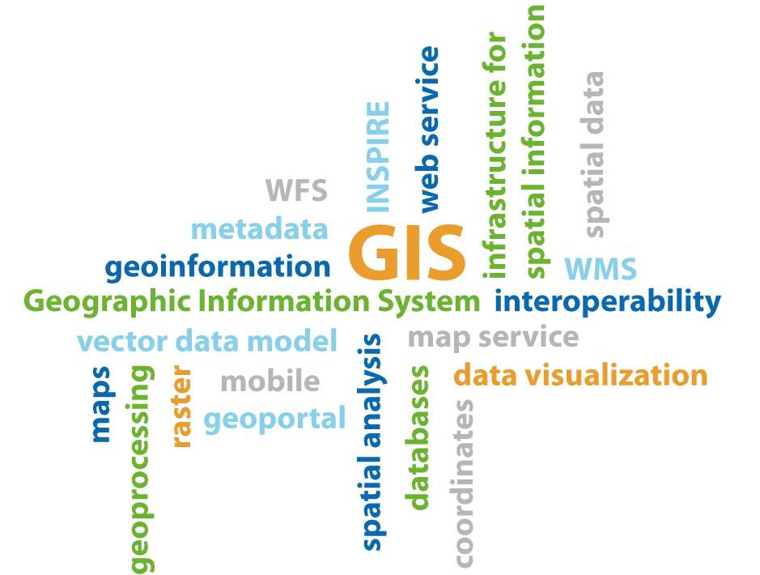

---
<!-- _footer: 1.USGS (United States Geological Survey) 2. ESRI-->

# GIS defination

Geographic Information System

  

"is a computer system capable of capturing, storing, analyzing, and displaying geographically referenced information; that is, data identified according to location. Practitioners also define a GIS as including the procedures, operating personnel, and spatial data that go into the system." 1 

"is a computer-based tool for mapping and analyzing things that exist and events that happen on earth. GIS technology integrates common database operations such as query and statistical analysis with the unique visualization and geographic analysis benefits offered by maps." 2

The spatial (geographic) part differentiates a GIS from a standard computer database.

---

# GIS components

A GIS consists of five key components: **hardware**, **software**, **data**, **people**, and **methods**.

| <!-- -->  | <!-- -->  | <!-- -->  | <!-- -->  | <!-- -->  |
|---|---|---|---|---|
|  |  |  |  |  |

---
# GIS: main idea

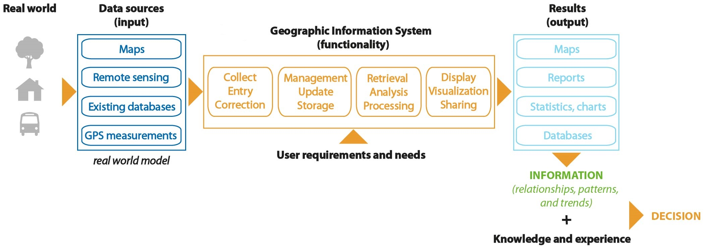

The main goal of GIS is to provide *spatial* information to decision makers.

---

# Data vs. Information

- **Data** means simply facts or figures - pieces of information, but not information itself.

- Data is collected and stored in databases. When data are processed, interpreted, organized, structured or presented so as to make them meaningful or useful, they are called information. Information provides context for data.

- In a GIS, spatial analysis and modelling are the main source of information.

- **Spatial analysis** - a set of methods and tools for performing operations on spatial data in order to obtain additional information.

--- 

# 1.2 | [Uses of GIS](./Introduction_to_GIS.md#4)

---

# Geospatial software and tools:

- **Desktop GIS** (QGIS, SAGA GIS, GRASS GIS, ILWIS, IDRISI, Esri products: ArcGIS, ArcMap, ArcGlobe, GeoMedia, MapInfo, Bentley Systems: MicroStation, ENVI, ERDAS IMAGINE) 

- **GIS** as a service (ArcGIS Online, Mapbox, OpenStreetMap, Google Maps, Apple Maps, Here Maps, Bing Maps)

-  **Spatial database management systems** (MySQL, Oracle Spatial, Microsoft SQL Server, PostgreSQL)

- **Map servers** (Geoserver, MapServer, Mapnik)

|   |   |
|---|---|
|  | 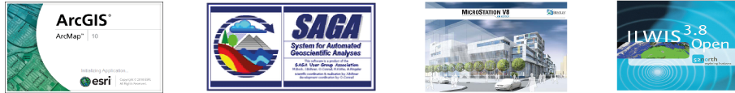 |

---

# Fields of GIS usage

  

- urban planning
- environment protection and management
- land use monitoring
- agriculture
- transportation/logistics
- emergency management
- network infrastructure management
- tourism
- ...

---
# Advantages of GIS

- Ability to view, visualize and interpret data in the form of maps, charts and reports - relationhips and trends easy to see and understand
- Improved decision making and problems solving through specific and detailed information regarding locations of features and phenomena
- Reduce costs and increase efficiency
- Improved communication between organisations or departments

---

# 2 | [Spatial data](./Introduction_to_GIS.md#2)

- 2.1 [Definition and properties](./Introduction_to_GIS.md#16)
- 2.2 [Vector data model](./Introduction_to_GIS.md#23)
- 2.3 [Raster data model](./Introduction_to_GIS.md#32)
- 2.4 [Comparing vector and raster data model](./Introduction_to_GIS.md#43)

---

# 2.1 | [Definition and properties](./Introduction_to_GIS.md#15)

---

# From real world

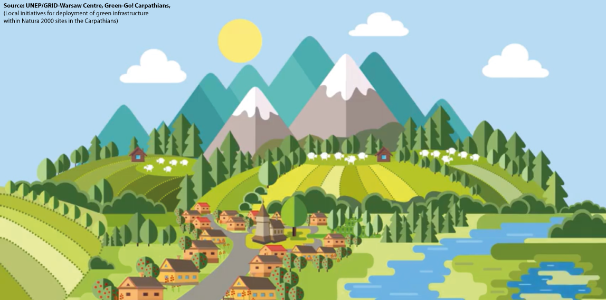

--- 
# ... to GIS

---

# Spatial data - definition

**Spatial object** means an abstract representation of a real-world phenomenon related to a specific location or geographical area.

**Spatial data** means any data with a direct or indirect reference to a specific location or geographical area.

**Spatial data** set means an identifiable collection of spatial data.

*DIRECTIVE 2007/2/EC of the European Parliament ad of the Council of 14 March 2007 establishing an Infrastructure for Spatial Information in the European Community (INSPIRE)*

---

# Data model

**Data model** is a set of guidelines to convert the real world (called entity) to the digitally and logically represented spatial objects consisting of the attributes and geometry.

The attributes are managed by thematic or semantic structure while the geometry is represented by geometric-topological structure.

*Shunji, 1999*

---

# Spatial data - properties

Spatial data describes **shape**, **location**, **spatial relationships** and *attributes* of features related to the Earth's surface.

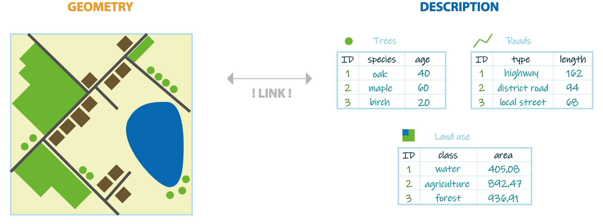

---

# Spatial data (representation) model

## Two common spatial data models:

- Vector

- Raster

--- 

# 2.2 | [Vector data model](./Introduction_to_GIS.md#15)

---

## Three types of geometry

A vector data model defines discrete objects such as fire hydrants, rivers, lakes.

A vector data models divided into three basic types:

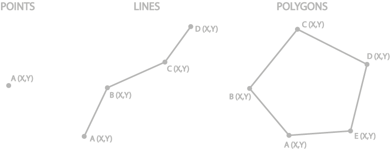

 All three of these types of vector data are composed of coordinates and attributes attached to the geometry. 

---

# Geometry: points

 1. 0-dimension objects 
2. represented by a single pair of coordinates (X,Y)
3. associated attribute information is attached to the center of the point
4. used to represent objects with no length or area (e.g. light poles, trees) or
5. used to represent a geographic feature too small to be displayed as a line or area (e.g. the location of a city on a small-scale map)
6. symbolized by a point or other sygnature (symbol) in different sizes and colors 

--- 

# Geometry: lines

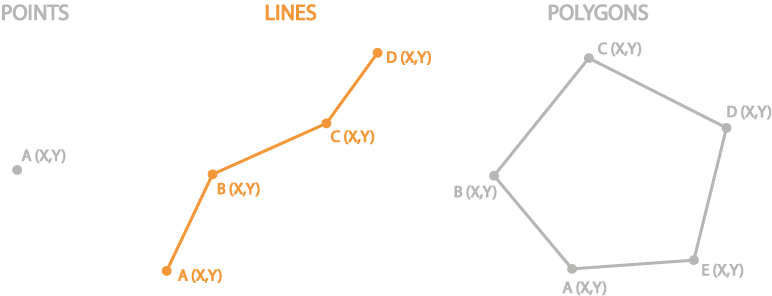

 1. 1-dimension objects
2. defined by an ordered set of two or more coordinate pairs called vertices
3. used to model linear features with no area (e.g. county boundary lines) or
4. used to represent the shape of geographic features too narrow to be displayed as an area at the given scale (e.g. contours, street centrelines, streams)
5. symbolized by different types of line that have a color, width and style (solid, dashed, dotted, etc. ...) 

---

# Geometry: polygons

 1. 2-dimension objects
2. composed of three or more connected lines where the start and end point have the same coordinate
3. attribute information is attached to the center of the polygon
4. used to represent areas (e.g. lakes, forests, cities)
5. represent length and area, embody the idea of an inside and an outside 

---

# Attribute table

An **attribute** is a nonspatial information about a geographic feature in a GIS, usually stored in a table and linked to the feature by a unique identifier (ID).

A database or tabular file containing information about a set of geographic features, usually arranged so that:

- each row represents a feature
- each column represents one feature attribute.

The attribute values can be used to find, query, analyze and symbolize features.

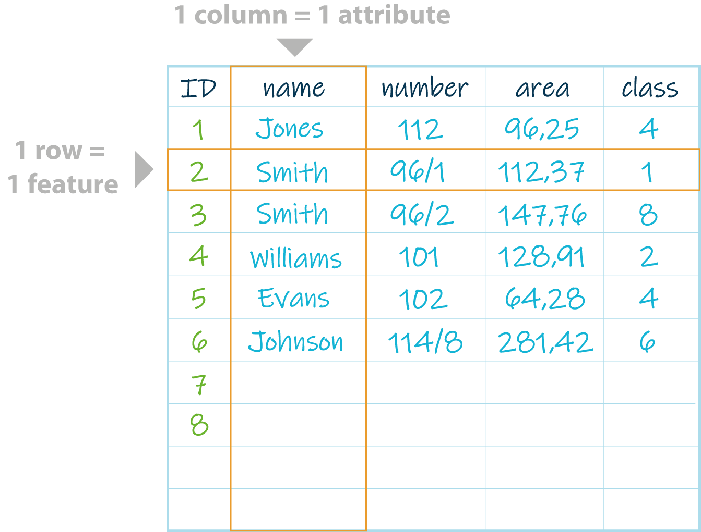

---

# Attribute table - data types

Each column in the database may contain different type of data.

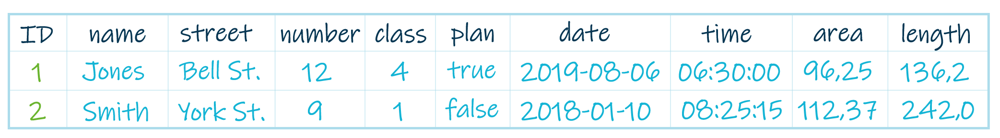

## Basic data types:

**NUMERIC**: INTEGER (long int, short int) - numbers, code list
**NUMERIC**: FLOAT (double, real) - floating-point numbers
**STRING** (char, varchar, text) - names and other texts
**DATE/TIME** (date, time, year, timestamp) - data and/or time
**BOOLEAN** (0/1, true/false, yes/no) - logical expression
**BLOB** - multimedia files

---

# Vector data sources

  

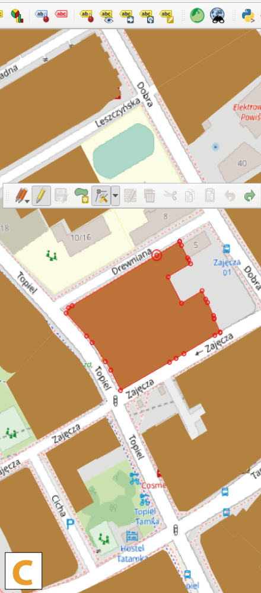

(A - GPS measurements, B - list of coordinates, C - digitizing and conversion tools e.g. raster to vector, D, E - existing databases)

---

# Vector file formats

- ESRI Shapefile - the most common geospatial file type developed by ESRI, consists of: 

    - shp (feature geometry)
    - shx (shape index position)
    - dbf (attribute data)
    - prj (projection system metadata)
    - xml (associated metadata)

- GML (Geography Markup Language) - XML based open standard for GIS data exchange
- KML/KMZ (Google Keyhole Markup Language) - XML based open standard for GIS data exchange
- GeoJSON (Geographic JavaScript Object Notation) - a lightweight format based on JSON, used by many open source GIS packages

---

# 2.3 | [RASTER DATA MODEL](./Introduction_to_GIS.md#15)

---

# Raster data model

A raster data model defines continous data and phenomena.

Raster's are:

- digital aerial photographs and satellites imagery (spectral data),
- continuous data represents phenomena - e.g. temperature, precipitation, elevation, slope,
- digital pictures, scanned maps and plans.

---

# Raster data model: geometry

A raster consists of a matrix of cells (or pixels) organized into rows and columns (or a grid) where each cell contains one value representing information such as temperature, elevation, or spectral data.

**Pixel** - smallest visible element of an image.

**Grid** - 2-D object feature that represents a single element of a continous surface.

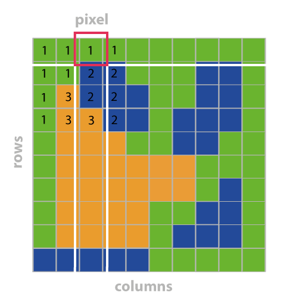

---
# Raster data model: georeferencing

Cells are identified by their positions in the grid.

Raster data is georeferenced by:

- real world coordinates of the reference point,
- cell size in real world distance,
- using the upper-left or lower-left corner of grid as the reference point.

---

# Spatial resolution

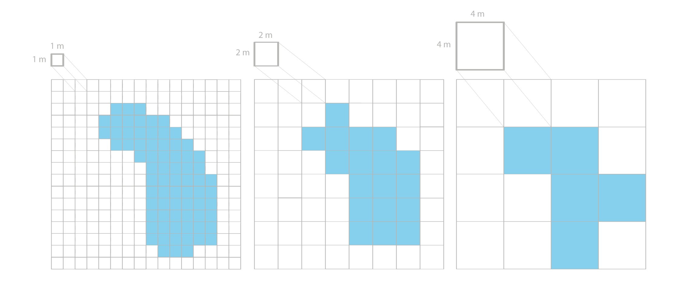

The same feature in images of different resolution

A **spatial resolution** refers to the dimension of the cell size representing the area covered on the ground. Higher resolution means better feature quality but it means also bigger raster file size.

---

# Raster bands

A raster dataset contains one or more layers called bands.

A band is represented by a single matrix of cell values.

For example, a **digital elevation model (DEM)** is a single-band raster (has one band holding elevation values) while **satellite imagery** is a multispectral image and has multiple bands.

Three main ways to display single-band raster datasets:

- binary image (each cell has a value of 0 or 1 and is often displayed using black and white),
- grayscale image (each cell has a value from 0 to another number, such as 255),
- color image (a set of values is coded to match a defined set of red, green, and blue (RGB) values).

---

# Raster bands

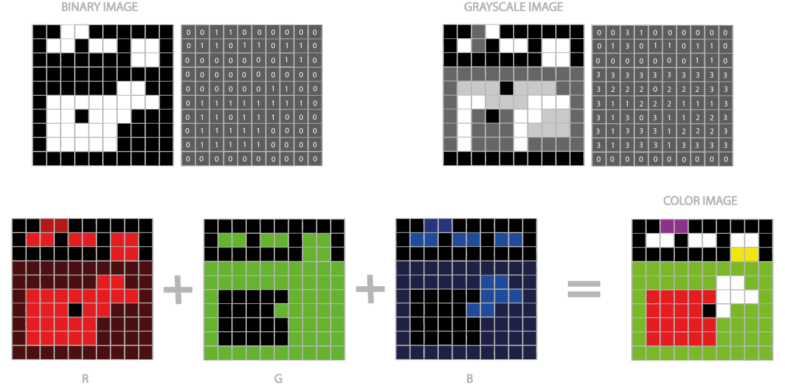

Three ways to display raster dataset (binary image, grayscale image and color image)

---

# Attribute table

Raster data can also have attributes only if pixels are represented using a small set of unique integer values. Raster datasets that contain attribute tables typically have cell values that represent or define a class, group, category, or membership.

In raster datasets, each row of an attribute table corresponds to a certain zone of cells having the same value.

The attribute tables can be used to analyze datasets and symbolize raster cells.

---

# Attribute table

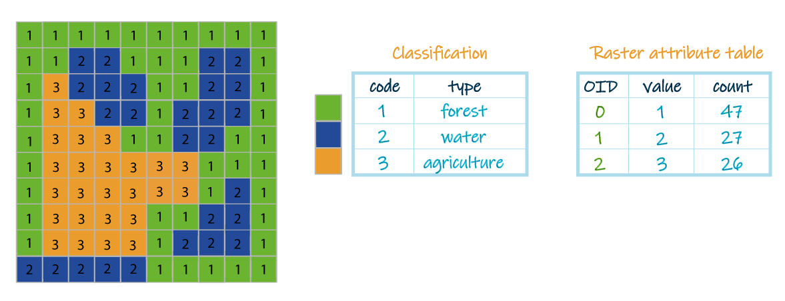

An example of raster dataset with attribute table

---

# Raster data sources

  
  
  

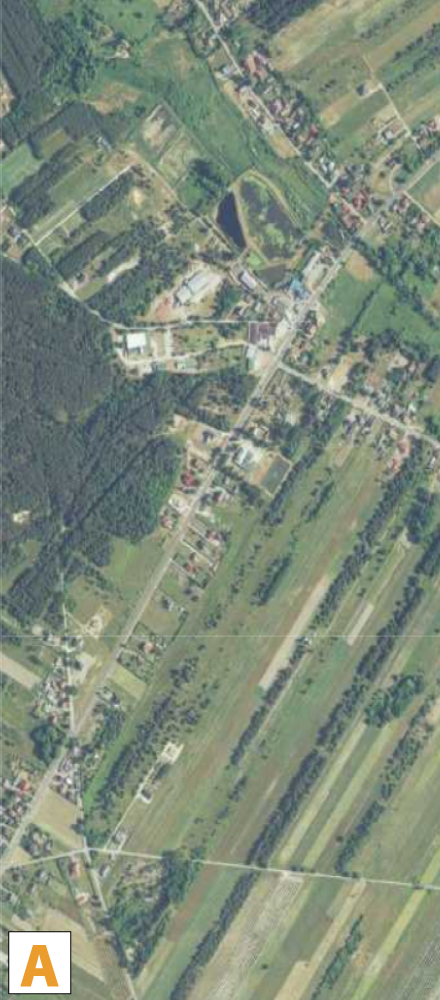
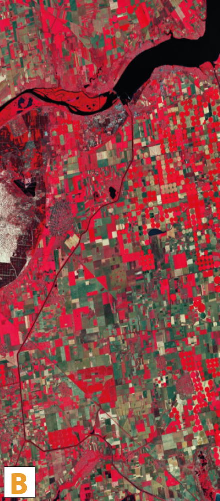
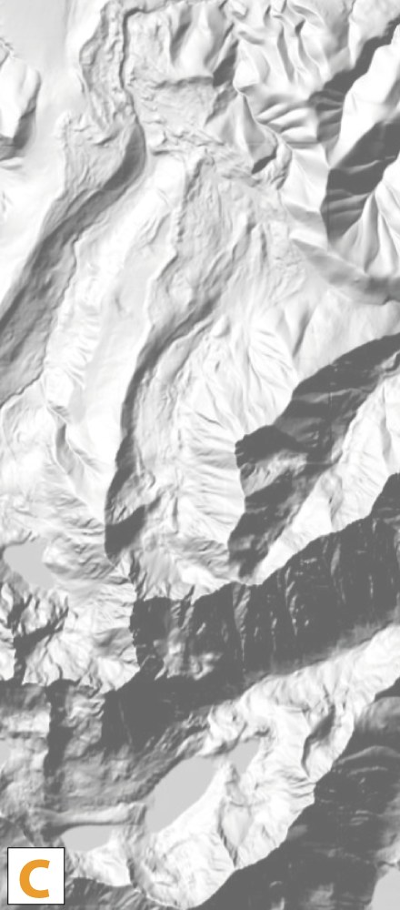
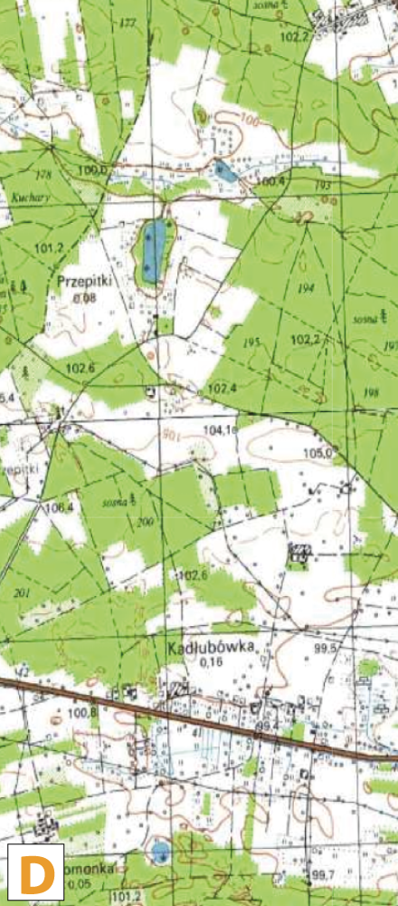

(A - orthophoto, B - satellite imagery, C - DEM, D - scanned maps and plans, E - conversion and analysis tools e.g. vector to raster, interpolation)

---

# Raster file formats

- GeoTIFF - TIFF variant enriched with GIS relevant metadata, may be accompanied by other files:
    - tfw (raster geolocation)
    - xml (metadata)
    - aux (projections and other information)
    - ovr (pyramid files improves performance for raster display)
- IMG - ERDAS IMAGINE image file format
- ESRI Grid - format developed by Esri, which has two varieties: binary or ASCII

---

# 2.4 | [COMPARING VECTOR AND RASTER DATA MODELS](./Introduction_to_GIS.md#15)

---

# Comparing: vector vs. raster data model

| properties     | vector                                        | raster                          |
|----------------|-----------------------------------------------|---------------------------------|
| depic          | discrete features                             | continous data                  |
| geometry       | coordinates                                   | cells organized into a grid     |
| attributes     | attribute table (with many attributes)        | cell value (only one attribute) |
| analysis       | geoprocessing                                 | map algebra, overlays           |
| data structure | more complex                                  | more simple                     |
| size           | compact data structure – little storage space | greater storage needed          |
| file formats   | ESRI Shapefile, GML, KML, geoJSON, GPX        | geoTIFF, IMG, grid              |

---

# Which one is better?

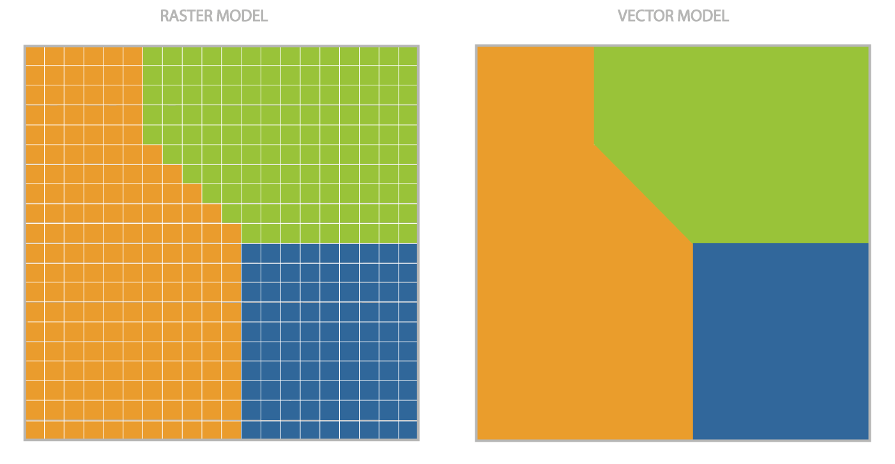

---

# Which one is better?

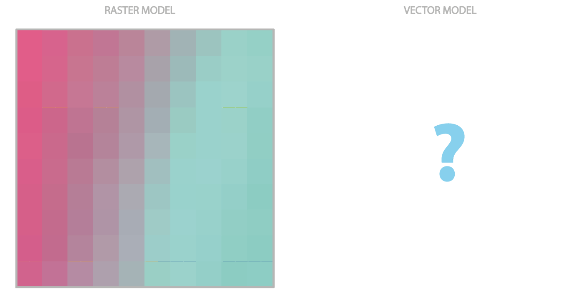

---

# [To be continued!](./Introduction_to_GIS.md#2)