<!-- _header:  -->
<!-- _footer: 24.10.2022 -->
# 地理信息系统概论

孟禹弛

---

<!-- paginate: true -->

# 地理信息系统概论

## 课程大纲

1. [GIS 基础](./Introduction_to_GIS_CN.md#4)
2. [空间数据](./Introduction_to_GIS_CN.md#16)
3. [空间参考坐标系](./Introduction_to_GIS_CN.md#50)
4. [基本空间分析](./Introduction_to_GIS_CN.md#50)
5. [数据可视化](./Introduction_to_GIS_CN.md#50)

--- 
<!-- paginate: true -->

# *教学目的与课程重点:*

1. Understand the basic concepts of Geographic Information Systems 理解地理信息系统相关基础概念、基础理论、基本原理、方法
2. Define terms related to raster and vector data models 定义矢量与栅格数据模型的基本概念
3. Compare vector and raster data models 对比矢量与栅格数据模型
4. Understand the difference between geographic and projected coordinate systems 理解地理坐标系与投影坐标系的区别
5. Select spatial objects using attribute and spatial queries 使用属性值查询空间目标
6. Perform simple analysis with geoprocessing tools 使用地理处理工具进行空间分析
7. List map elements and basic principles of map creation 列举基本地图要素与地图制作的基本原理
8. Create a thematic map using different methods of symbolization 使用不同符号化方法制作一幅主题图

---
# 1 | [GIS 基础](./Introduction_to_GIS_CN.md#2)

- 1.1 [什么是GIS？](./Introduction_to_GIS_CN.md#5)
- 1.2 [GIS的应用](./Introduction_to_GIS_CN.md#12)

---

# 1.1 | [什么是GIS?](./Introduction_to_GIS_CN.md#4)

---
<!-- _footer: 1.https://eo4geo.sbg.ac.at/UNEP-Grid/Introduction-to-GIS/gis.png -->
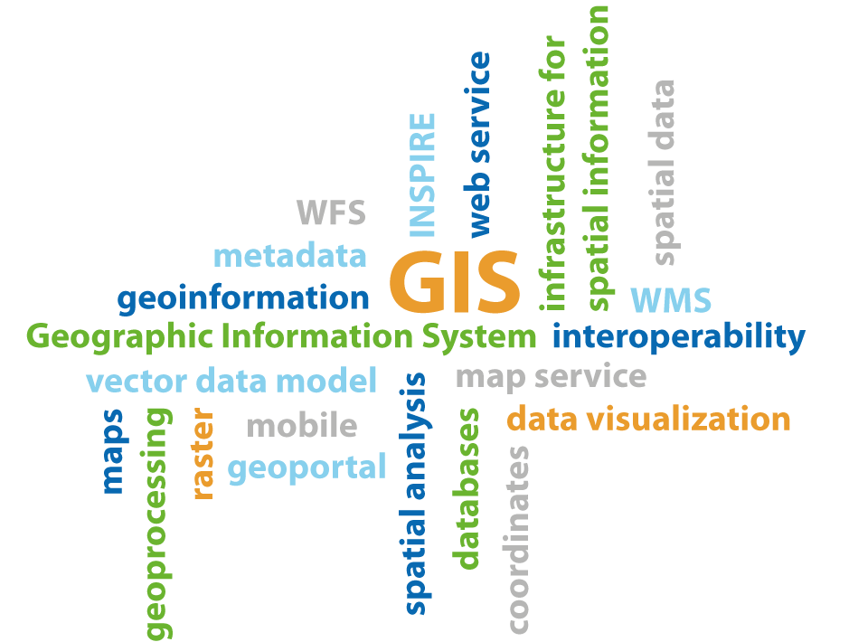

---
<!-- _footer: 1.USGS (United States Geological Survey) 2. ESRI-->

# 理解GIS 

Geographic Information System

  

"is a computer system capable of capturing, storing, analyzing, and displaying geographically referenced information; that is, data identified according to location. Practitioners also define a GIS as including the procedures, operating personnel, and spatial data that go into the system." 1 

"is a computer-based tool for mapping and analyzing things that exist and events that happen on earth. GIS technology integrates common database operations such as query and statistical analysis with the unique visualization and geographic analysis benefits offered by maps." 2

The spatial (geographic) part differentiates a GIS from a standard computer database.

---

# GIS的组成

GIS的关键组成部分:
**硬件系统**, **软件系统**, **空间数据**, **应用人员**, 与 **地学模型和管理**.

| <!-- -->  | <!-- -->  | <!-- -->  | <!-- -->  | <!-- -->  |
|---|---|---|---|---|
|  |  |  |  |  |

---

# GIS: main idea主要目标

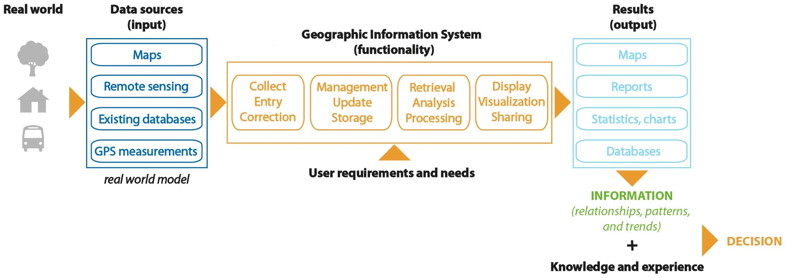

**GIS** 为决策者提供与 `空间` 相关的信息！

---

# 数据 vs. 信息

**数据** 是人类在认识世界和改造世界过程中，定性或定量对事物和环境描述的直接或间接原始记录，是一种未经加工的原始资料，是客观对象的表示。

**信息** 是用文字、数字、符号、语言、图像等介质来表示事件、事物、现象等的内容、数量或特征，从而向人们（或系统）提供关于现实世界新的事实和知识，作为生产、建设、经营、管理、分析和决策的依据。

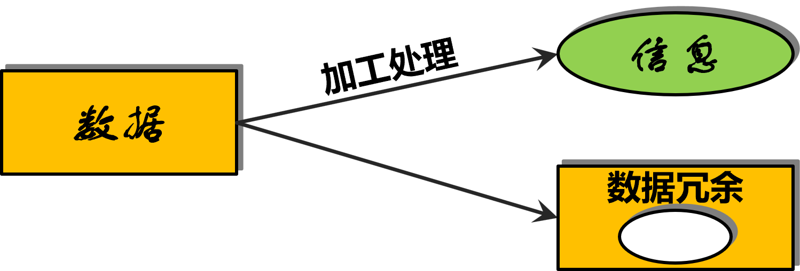

---

# 数据 vs. 信息

- **信息**来源于**数据**，是数据内涵的意义和数据内容的解释。信息是一种客观存在，而数据是客观对象的一种表示，其*本身并不是信息*。

- 数据所蕴涵的信息不会自动呈现出来，需要利用一种技术，如统计、解译、编码等对其解释，信息才能呈现出来。信息是数据的表达，数据是信息的载体。

- 在GIS中，空间分析与建模是信息的主要来源。

- **空间分析** - a set of methods and tools for performing operations on spatial data in order to obtain additional information.

--- 

# 1.2 | [GIS的应用](./Introduction_to_GIS_CN.md#4)

---

# GIS软件与工具与:

- **Desktop GIS** (QGIS, SAGA GIS, GRASS GIS, ILWIS, IDRISI, Esri products: ArcGIS, ArcMap, ArcGlobe, GeoMedia, MapInfo, Bentley Systems: MicroStation, ENVI, ERDAS IMAGINE) 

- **GIS** as a service (ArcGIS Online, Mapbox, OpenStreetMap, Google Maps, Apple Maps, Here Maps, Bing Maps)

-  **Spatial database management systems** (MySQL, Oracle Spatial, Microsoft SQL Server, PostgreSQL)

- **Map servers** (Geoserver, MapServer, Mapnik)

|   |   |
|---|---|
|  | 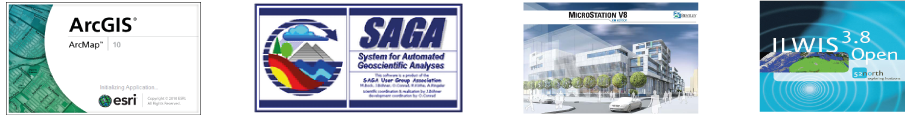 |

---

# GIS的应用领域

  

- urban planning
- environment protection and management
- land use monitoring
- agriculture
- transportation/logistics
- emergency management
- network infrastructure management
- tourism
- ...

---
# GIS的优势

- Ability to view, visualize and interpret data in the form of maps, charts and reports - relationhips and trends easy to see and understand 能够以地图、图标与报告等形式直观的展示与解释数据
- Improved decision making and problems solving through specific and detailed information regarding locations of features and phenomena 能够通过详细的地理信息要素与现象来提升决策与解决问题的能力
- Reduce costs and increase efficiency 减少支出并且提升效率
- Improved communication between organisations or departments 增强各部门与协会之间的沟通

---

# 2 | [空间数据](./Introduction_to_GIS_CN.md#2)

- 2.1 [空间数据模型](./Introduction_to_GIS_CN.md#17)
- 2.2 [空间数据结构](./Introduction_to_GIS_CN.md#49)

---

# 2.1 | [空间数据模型](./Introduction_to_GIS_CN.md#16)

- 2.1.1 [定义与特征](./Introduction_to_GIS_CN.md#17)
- 2.1.2 [矢量数据模型](./Introduction_to_GIS_CN.md#24)
- 2.1.3 [栅格数据模型](./Introduction_to_GIS_CN.md#33)
- 2.1.4 [矢量与栅格数据模型对比](./Introduction_to_GIS_CN.md#45)

---

# 2.1 | [定义与特征](./Introduction_to_GIS_CN.md#16)

---

# From real world

--- 
# ... to GIS

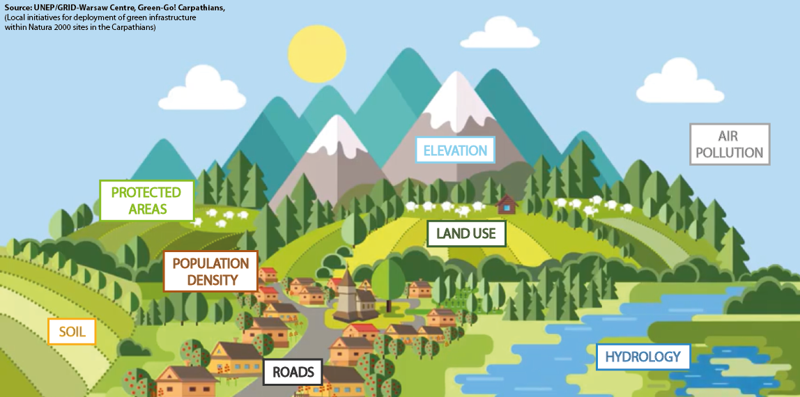

---

# 空间数据 - 定义

**空间数据结构**(spatial data structure)是指对空间数据逻辑模型描述的数据组织关系和编排方式的具体实现，对地理信息系统中数据`存储`、`查询检索`和`应用分析`等操作处理的效率有着至关重要的影响。

空间数据结构是地理信息系统沟通信息的桥梁，只有充分理解地理信息系统所采用的特定数据结构，才能正确有效地使用系统。

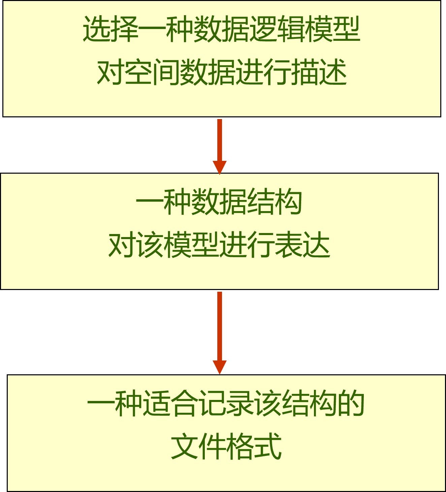

---

# 空间数据 - 特征

在地理信息系统中描述地理要素和地理现象的空间数据，主要包括**空间位置**、**拓扑关系**和**属性**三个方面的内容。

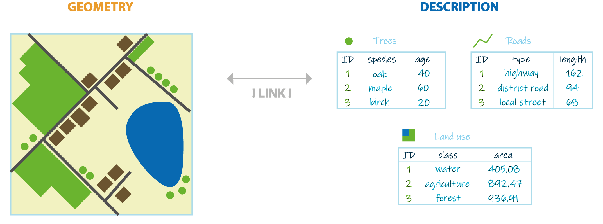

---

# 2种常用的空间数据模型:

- Vector 矢量

- Raster 栅格

--- 

# 2.2 | [矢量数据模型](./Introduction_to_GIS_CN.md#17)

## “位置明显，属性隐含”

用X、Y坐标表示地图图形或地理试题的位置和形状的数据。矢量数据一般通过记录坐标的方式来尽可能将地理实体的空间位置表现的准确无误。

---

## 三种实体类型

**点实体**：在二维空间中，点实体可以用一对坐标X，Y来确定位置；

**线实体**：线实体可以认为是由连续的直线段组成的曲线，用坐标串的集合（X1，Y1，X2，Y2……Xn，Yn）来记录；

**面实体**：在记录面实体时，通常通过记录面状地物的边界即条闭合的线来表达，因而有时也称为多边形数据。

 All three of these types of vector data are composed of coordinates and attributes attached to the geometry. 

---

# 点实体

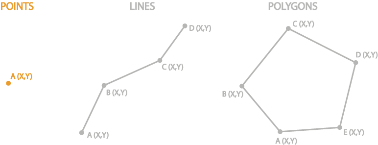

 

1. 0-dimension objects
2. represented by a single pair of coordinates (X,Y)
3. associated attribute information is attached to the center of the point
4. used to represent objects with no length or area (e.g. light poles, trees) or
5. used to represent a geographic feature too small to be displayed as a line or area (e.g. the location of a city on a small-scale map)
6. symbolized by a point or other sygnature (symbol) in different sizes and colors 

--- 

# 线实体

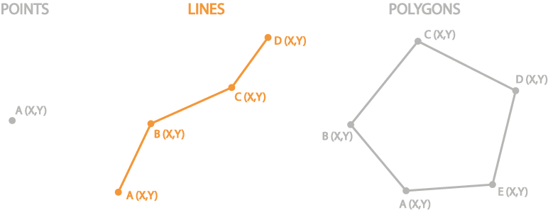

 

1. 1-dimension objects
2. defined by an ordered set of two or more coordinate pairs called vertices
3. used to model linear features with no area (e.g. county boundary lines) or
4. used to represent the shape of geographic features too narrow to be displayed as an area at the given scale (e.g. contours, street centrelines, streams)
5. symbolized by different types of line that have a color, width and style (solid, dashed, dotted, etc. ...) 

---

# 面实体

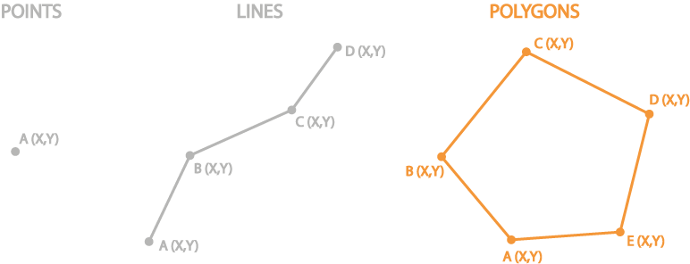

 

1. 2-dimension objects
2. composed of three or more connected lines where the start and end point have the same coordinate
3. attribute information is attached to the center of the polygon
4. used to represent areas (e.g. lakes, forests, cities)
5. represent length and area, embody the idea of an inside and an outside 

---

# 属性表

 GIS中的属性表是用来存储地理要素的非空间信息，通常使用特殊标识符（unique identifer）将表格信息同地理要素链接。

地理数据库或表格文件包含一个地理元素集的信息，通常表现为：

- 每行代表一个地理元素，
- 每列代表一个元素属性。

属性值可以快速方便的查阅，检索，分析与符号化地理要素。

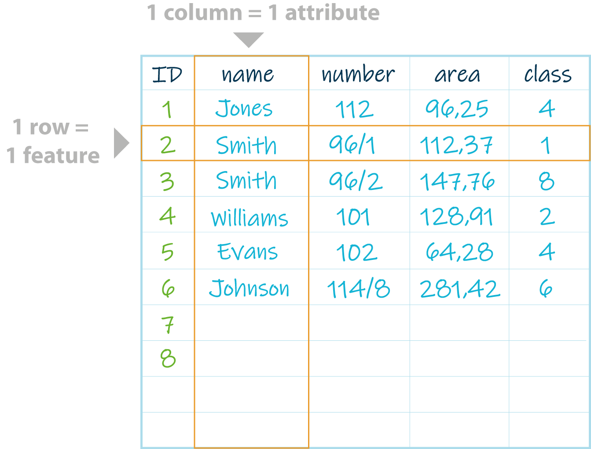

---

# 属性表 - 数据类型

数据库中每列都可以是不同的数据类型

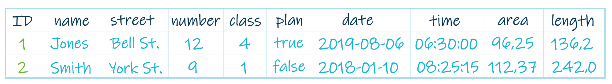

## 一些基本数据类型:

**值类数型 NUMERIC**: INTEGER (long int, short int) - numbers, code list
**浮点型数值 NUMERIC**: FLOAT (double, real) - floating-point numbers
**字符型 STRING** (char, varchar, text) - names and other texts
**日期类型 DATE/TIME** (date, time, year, timestamp) - data and/or time
**布尔类型 BOOLEAN** (0/1, true/false, yes/no) - logical expression
**多媒体类型 BLOB** - multimedia files

---

# 矢量数据来源

  

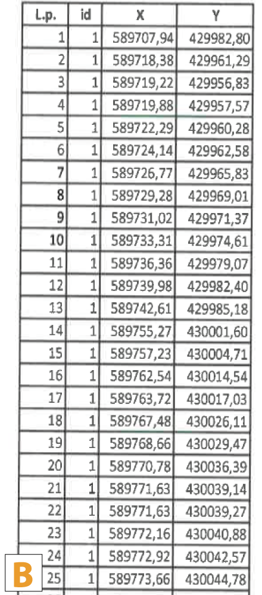
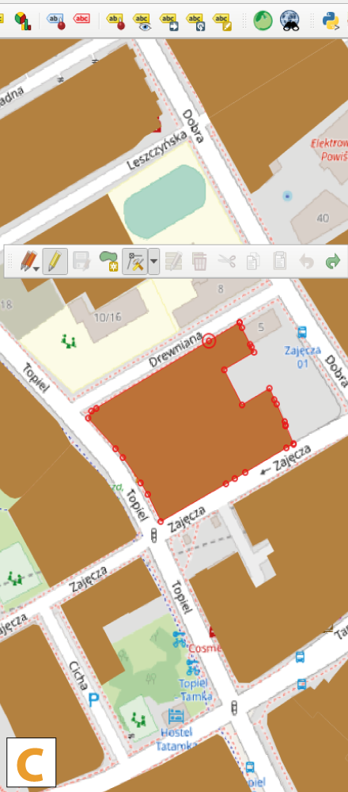
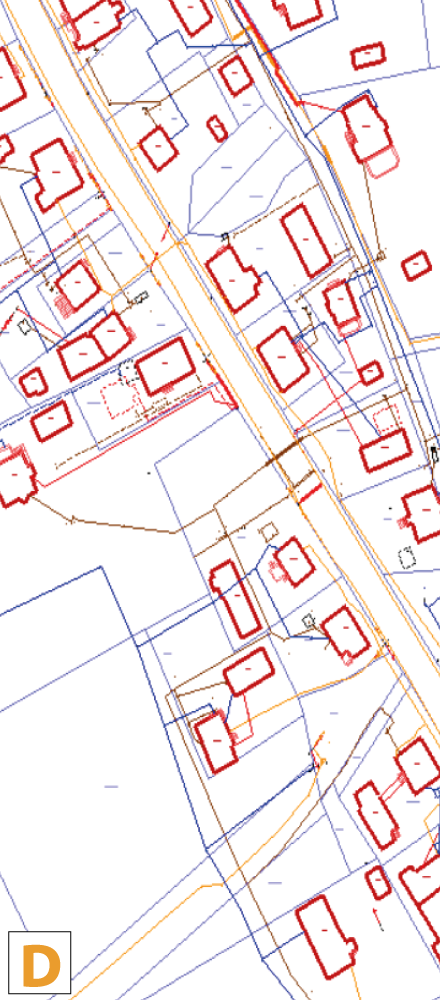
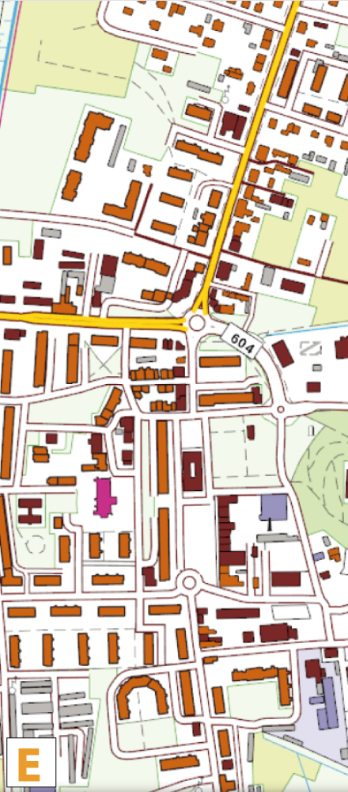

(A - GPS measurements, B - list of coordinates, C - digitizing and conversion tools e.g. raster to vector, D, E - existing databases)

---

# 矢量数据格式

- ESRI Shapefile - the most common geospatial file type developed by ESRI, consists of: 

    - shp (feature geometry)
    - shx (shape index position)
    - dbf (attribute data)
    - prj (projection system metadata)
    - xml (associated metadata)

- GML (Geography Markup Language) - XML based open standard for GIS data exchange
- KML/KMZ (Google Keyhole Markup Language) - XML based open standard for GIS data exchange
- GeoJSON (Geographic JavaScript Object Notation) - a lightweight format based on JSON, used by many open source GIS packages

---

# 2.3 | [栅格数据模型](./Introduction_to_GIS_CN.md#17)

## “属性明显，位置隐含”

最简形式的栅格由按行和列（或格网）组织的像元（或像素）矩阵组成，其中的每个像元都包含一个信息值（例如温度）。栅格可以是数字航空像片、卫星影像、数字图片或甚至扫描的地图。

---

# 栅格数据模型

以栅格格式存储的数据可以表示各种实际现象：

- 专题数据（也称为离散数据）表示土地利用或土壤数据等要素。

- 连续数据表示温度、高程或光谱数据（例如，卫星影像或航空像片）等现象。

- 图片则包括扫描的地图或绘图，以及建筑物照片。

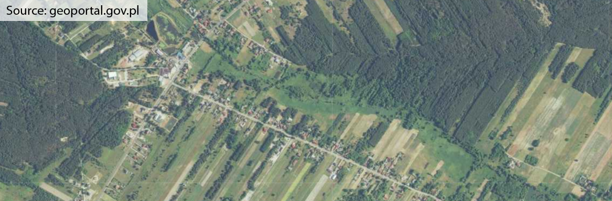

---

# 栅格数据模型：用法1

## 底图

在 GIS 中，栅格数据通常用来作为其他要素图层的背景显示画面。例如，在其他图层下显示正射影像，这不仅可提供附加的信息，而且还可使地图用户更加确信地图图层在空间上已经对齐并代表着实际的对象。栅格底图共有三种主要来源，分别为正射航空摄影、正射卫星影像和正射的扫描地图。下面是一个用作道路数据底图的栅格。

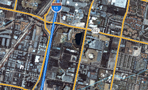

---
# 栅格数据模型：用法2

## 表面地图

栅格非常适合表示那些沿地表（表面）连续变化的数据。这是将连续数据存储为表面的有效方法。它们还能以固定间距来表示表面。从地球表面测得的高程值是表面地图的最常见应用，但也可将其他值（例如降雨量、温度、密度和人口密度等）定义为可进行空间分析的表面。下方的栅格便显示了高程，其中使用绿色显示较低的高程，红色、粉红色和白色像元则表示较高的高程。

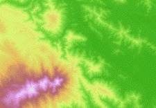

---

# 栅格数据模型：用法3

## 主题地图

表示主题数据的栅格可通过分析其他数据获得。一个常见的分析应用是按照土地覆盖类别来对卫星影像的内容进行分类。基本上，此活动可将多光谱数据划分到各个类（例如植被类型）中并指定类别值。通过将矢量、栅格和 terrain 数据等不同来源的各种数据进行组合也可得到主题地图。例如，要为特定的活动创建一个适宜的栅格数据集，则可通过使用地理处理模型来处理数据的方式实现。下方的示例是显示土地利用的分类栅格数据集。

  

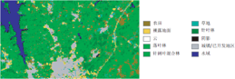

---

# 栅格数据模型：用法4

## 要素属性

用作要素属性的栅格可以是与地理对象或位置相关的数字照片、扫描的文档或扫描的绘图。宗地图层可能具有识别宗地最新事务的扫描法律文档；表示洞穴开口的图层可能具有与点要素关联的实际洞穴开口的图片。下方是一棵大型古树的数字图片，可用作城市地表图层的属性。

  

---

# 栅格波段

一些栅格具有单波段或单图层（单个特征的量度）的数据，另一些栅格具有多个波段。

基本上，一个像元值矩阵表示一个波段，而一个具有多个波段的栅格则包含多个在空间上重合的表示同一个空间区域的像元值矩阵。

数字高程模型 (DEM) 即是一个单波段栅格数据集的示例。DEM 中的每个像元只包含一个表示表面高程的值。还有一种有时被称为全色图像或灰度图像的单波段正射影像。多数卫星影像都具有多个波段，通常包含电磁光谱某个范围或波段内的值。

---

# 单波段栅格数据集渲染方式

- 使用两种颜色 - 在二进制图像中，每个像元的值均为 0 或 1，且通常显示为黑色和白色。此种显示类型通常用于显示包含简单线作业的扫描地图，如宗地地图。
- 灰度 - 在灰度图像中，每个像元的值范围为 0 到其他数值（如 255 或 65535）。这些图像通常用于黑白航空像片。
- 色彩映射 - 色彩映射是表示图像颜色的一种方法。对一组值进行编码，以使其与一组已定义的红色、绿色和蓝色 (RGB) 值相匹配。

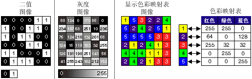

---

# 多波段栅格数据集

  

如果存在多个波段，则每个像元位置都有多个值与之关联。在具有多个波段的情况下，各波段通常表示由传感器采集到的电磁光谱的一部分。波段可以表示电磁光谱的任何部分，其中包括非可见光谱范围，如红外区或紫外区。术语波段源自对电磁光谱上色带的引用。

  

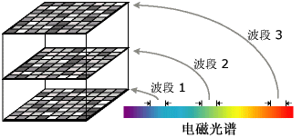

---

# 多波段栅格数据集

  

根据栅格图像创建地图图层时，可以选择显示单波段数据或根据多个波段形成彩色合成图。可以使用多波段栅格数据集中的任意三个可用波段的组合来创建 RGB 合成图。与仅处理一个波段相比，通过将多个波段共同显示为 RGB 合成图通常可从数据集收集到更多信息。

  

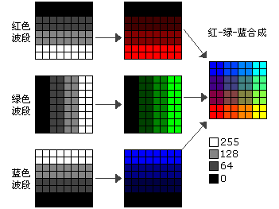

---

# 栅格数据源

  
  
  

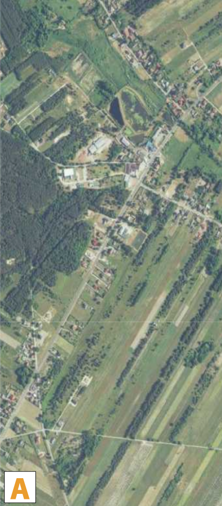
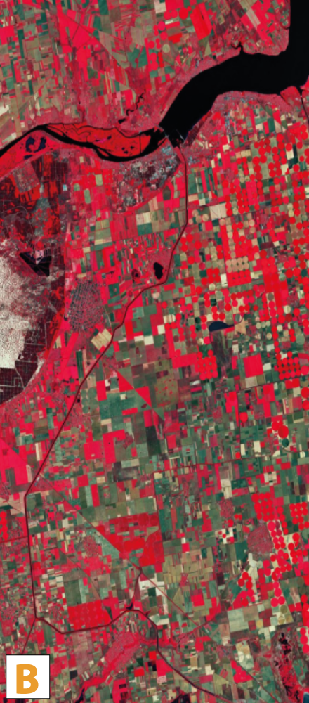
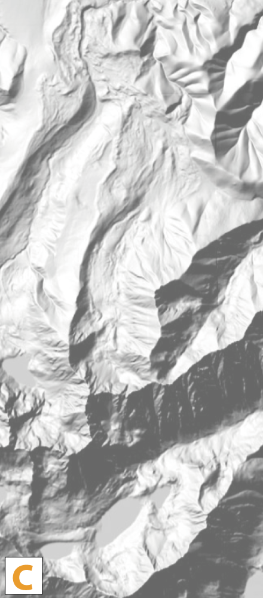
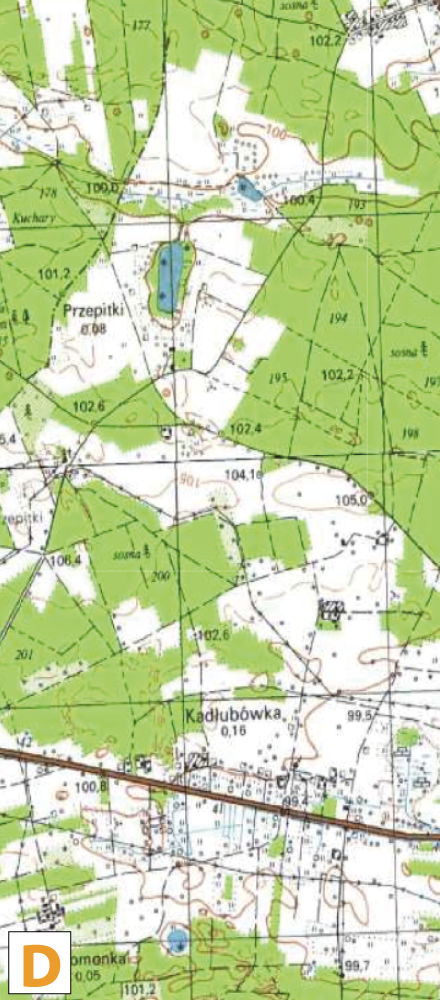
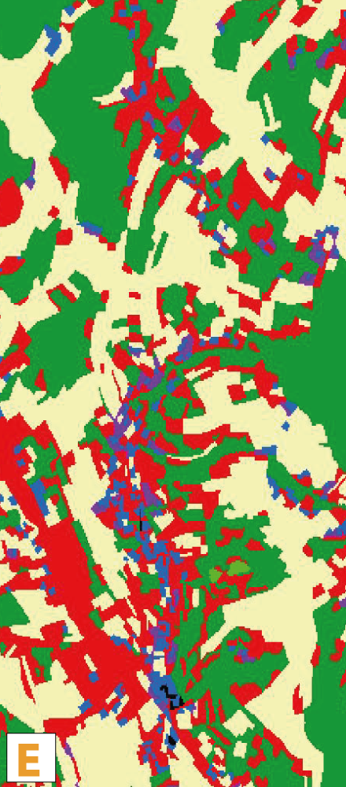

(A - orthophoto, B - satellite imagery, C - DEM, D - scanned maps and plans, E - conversion and analysis tools e.g. vector to raster, interpolation)

---

# 栅格数据存储格式

- GeoTIFF - TIFF variant enriched with GIS relevant metadata, may be accompanied by other files:
    - tfw (raster geolocation)
    - xml (metadata)
    - aux (projections and other information)
    - ovr (pyramid files improves performance for raster display)
- IMG - ERDAS IMAGINE image file format
- ESRI Grid - format developed by Esri, which has two varieties: binary or ASCII

---

# 2.4 | [矢量与栅格数据模型对比](./Introduction_to_GIS_CN.md#17)

---

# 矢量与栅格数据模型对比

| properties     | vector                                        | raster                          |
|----------------|-----------------------------------------------|---------------------------------|
| depic          | discrete features                             | continous data                  |
| geometry       | coordinates                                   | cells organized into a grid     |
| attributes     | attribute table (with many attributes)        | cell value (only one attribute) |
| analysis       | geoprocessing                                 | map algebra, overlays           |
| data structure | more complex                                  | more simple                     |
| size           | compact data structure – little storage space | greater storage needed          |
| file formats   | ESRI Shapefile, GML, KML, geoJSON, GPX        | geoTIFF, IMG, grid              |

---

# Which one is better?

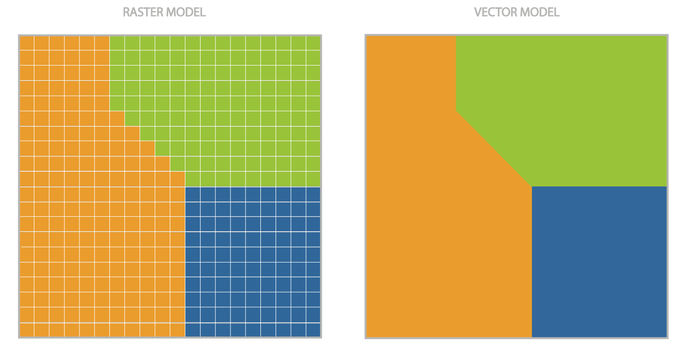

---

# Which one is better?

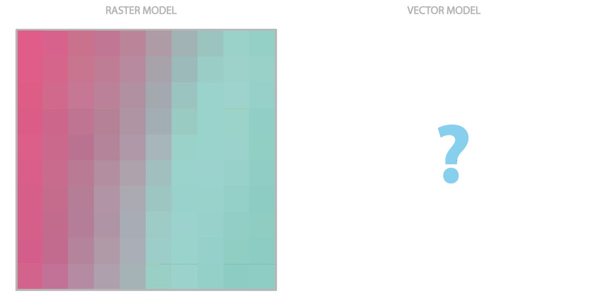

---

# [空间数据结构](./Introduction_to_GIS_CN.md#16)

---

# [To be continued!](./Introduction_to_GIS_CN.md#2)